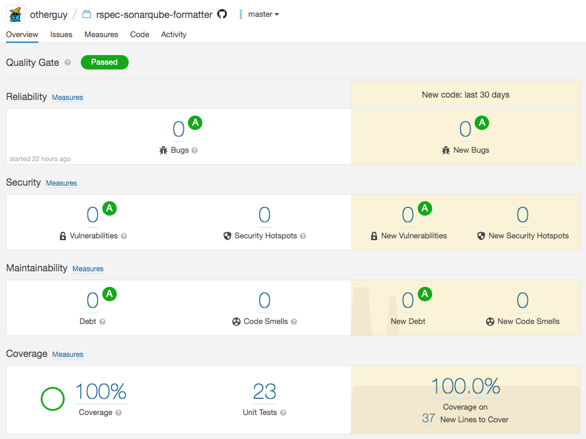

# RSpec SonarQube Formatter

[RSpec 3](https://rspec.info/) formatter that generates an XML file for [SonarQube](https://www.sonarqube.org/) 6.2+, using 
the [Generic Test Data](https://docs.sonarqube.org/latest/analysis/generic-test/) format.

[][rubygems]
[][rubygems]
[][issues]
[][travis]
[][sonarqube]
[][coveralls]
[][codeclimate]
[][license]

[rubygems]: https://rubygems.org/gems/rspec-sonarqube-formatter
[issues]: https://github.com/otherguy/rspec-sonarqube-formatter/issues
[travis]: https://travis-ci.com/otherguy/rspec-sonarqube-formatter
[coveralls]: https://coveralls.io/github/otherguy/rspec-sonarqube-formatter
[codeclimate]: https://codeclimate.com/github/otherguy/rspec-sonarqube-formatter
[sonarqube]: https://sonarcloud.io/dashboard?id=otherguy_rspec-sonarqube-formatter
[license]: https://github.com/otherguy/rspec-sonarqube-formatter/blob/master/LICENSE.md

## Features 🌈

This formatter generates an XML report that can be read by [SonarQube](https://www.sonarqube.org/) 6.2+. 
Out of the box, SonarQube 6.2+ supports generic formats for test coverage and test execution import. Using the XML file 
generated by this gem, you get an overview of test executions (`passed`, `skipped`, `failed`)
and the time in milliseconds it took to execute these. 

[][sonarqube]️

## Installation 🚀

Add the gem to your application's `Gemfile`:

```ruby
# RSpec formatters
gem 'rspec-sonarqube-formatter', '~> 1.3', require: false
```

Then, update your bundle:

    $ bundle install

Or install it manually using:

    $ gem install rspec-sonarqube-formatter


## Usage 🛠

Add the following code to your `spec_helper.rb`:

```ruby
RSpec.configure do |c|
  c.formatter = 'documentation'
  c.add_formatter('RspecSonarqubeFormatter', 'out/test-report.xml')
  ...
end
```

Alternatively, edit your `.rspec` file to define your formatters there:

```bash
# .rspec
--require spec_helper
--color
--format RspecSonarqubeFormatter
--out out/test-report.xml
--format documentation
```

To make SonarQube read the test report, specify the path to the generated XML in your 
[`sonar-project.properties`](sonar-project.properties) or configure it in the SonarQube GUI. 

```bash
# sonar-project.properties
sonar.testExecutionReportPaths=out/test-report.xml
```

## Inspiration 💅

The only [existing formatter](https://github.com/witjoh/rspec_sonar_formatter) does not work out of the box and is not
published to [RubyGems.org](https://rubygems.org/gems/rspec-sonarqube-formatter), so I created my own.

Thank you to [`@witjoh`](https://github.com/witjoh) for the original work ♥️!


## Contributing 🚧

Bug reports and pull requests are welcome on GitHub at [`otherguy/rspec-sonarqube-formatter`](https://github.com/otherguy/rspec-sonarqube-formatter).

After checking out the repository, you need to install dependencies:

```bash
gem install bundler -v 2.0.2
bundle install
```

Then, run `bundle exec rake spec` to run the test suite. 

To install this gem on your local machine, run `bundle exec rake install`.

Please check your contributions with RuboCop by running `bundle exec rubocop`. 

Releases are built from tags automatically on [Travis][travis] and pushed to [RubyGems.org][rubygems].
